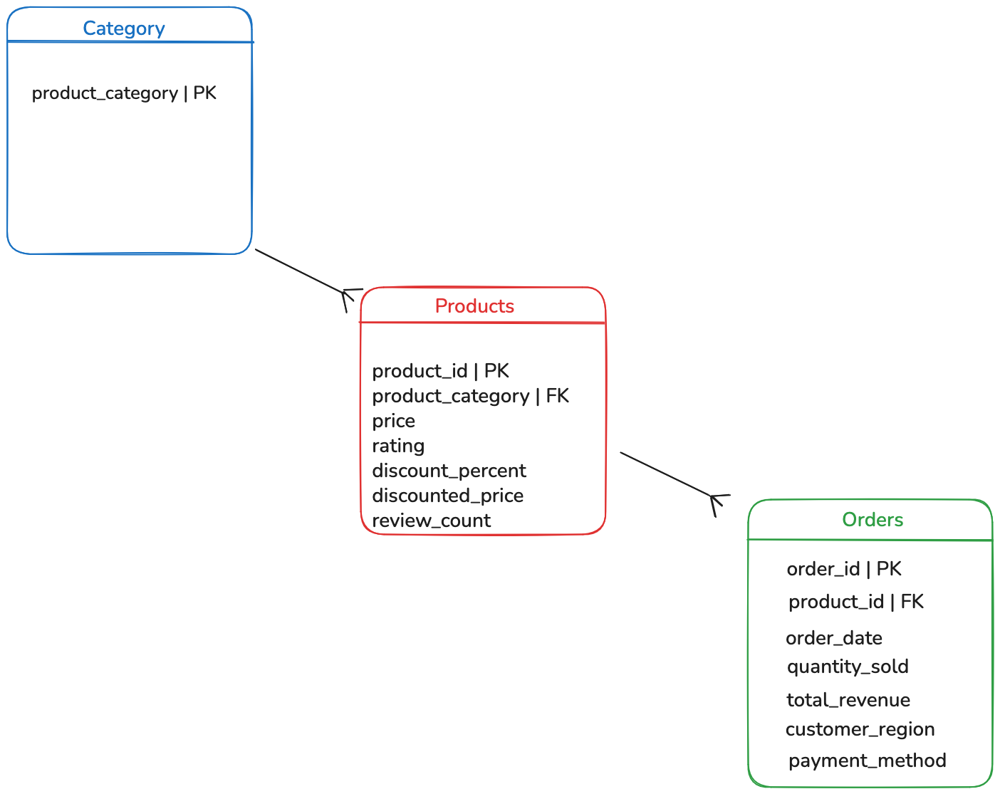

Homework #2 - Week 5

For this week I did the descriptive statistics for my amazon dataset using the clean data from the last homework, I started checking the name of the number columns then I used the describe function to see the mean and the standard deviation for each column except the id ones like order_id and product_id. I also calculated the variance and the range because I wanted to see how much the data changes between each sale.

I also identified the entities for the diagram like Products, Categories and Orders. Basically the category is like the parent of many products and everything is linked with the order id. I used groupby to see this better in the code and I found that Beauty has the most revenue but not for much.

I checked the correlation too between rating and sales and I honestly thought that better ratings meant more sales but the result was -0.0029 so there is no relation at all. It was kind of weird to see that because in the day of day I only buy things with good review but that is correlation says, the grouping part was the harder because I didn't know how to configure a different parts of the csv

In my diagram I separated the data into three tables. Category is the main one because one category can have many Products (1 to many), then each product can appear in many different Orders (1 to many). I used the product_category and product_id as the keys to connect everything: 

## Database Diagram

